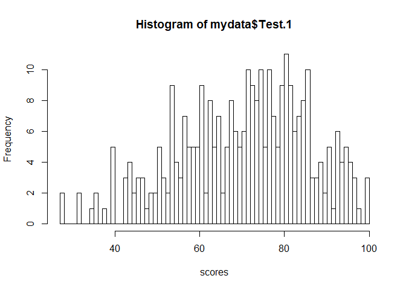

**Assignment 2** 
-----------------

### **Question 3** 

  

``` r
# Name Brand I stratum 1:
N1 = 120
lastyrSale1 = 24500
popMu1 = lastyrSale1/N1
# the sample values are:
x1 <- c(204, 143, 82, 256, 275, 198)
y1 <- c(210, 160, 75, 280, 300, 190)
# number of samples:
n1 = length(y1)


# Name Brand II stratum 2:
N2 = 180
lastyrSale2 = 21200
popMu2 = lastyrSale2/N2
# the sample values are:
x2 <- c(137, 189, 119, 63, 103, 107, 159, 63, 87)
y2 <- c(150, 200, 125, 60, 110, 100, 180, 75, 90)
# number of samples:
n2 = length(y2)


# total population size
N = N1+N2
# weight
W1 = N1/N
W2 = N2/N
# fractions
f1 = n1/N1
f2 = n2/N2
# sample mean for brand I
y1_bar = mean(y1)
x1_bar = mean(x1)
# sample mean for Brand II
y2_bar = mean(y2)
x2_bar = mean(x2)
# sample variance for brand I
y1_s2 = var(y1)
x1_s2 = var(x1)
# sample variance for Brand II
y2_s2 = var(y2)
x2_s2 = var(x2)
# coefficients between x and y (brand I)
corr1 = cor(y1, x1)
# coefficients between x and y (brand II)
corr2 = cor(y2, x2)
```

  
\#\#\#\# **Part 1**  

``` r
tau_hat = N1*y1_bar+N2*y2_bar
tau_hat
```

    ## [1] 46100

  
From the output above, the basic estimate of total potential sales is:  
<center>
*τ̂* = *τ̂*<sub>1</sub> + *τ̂*<sub>2</sub> = (*N*<sub>1</sub>*ȳ*<sub>1</sub>) + (*N*<sub>2</sub>*ȳ*<sub>2</sub>) = 46100
</center>

  
  

``` r
var_hat_mu_hat_1 = (1-f1)*(y1_s2/n1)
var_hat_mu_hat_2 = (1-f2)*(y2_s2/n2)
var_hat_tau_hat = N1^2*var_hat_mu_hat_1+N2^2*var_hat_mu_hat_2
var_hat_tau_hat
```

    ## [1] 23075975

  
From the output above, the estimated variance is:  
<center>
*V̂*(*τ̂*) = *V̂*(*τ̂*<sub>1</sub>) + *V̂*(*τ̂*<sub>2</sub>) = *N*<sub>1</sub><sup>2</sup> × (1 − *n*<sub>1</sub>/*N*<sub>1</sub>) × *s*<sub>*y*<sub>1</sub></sub><sup>2</sup>/*n*<sub>1</sub> + *N*<sub>2</sub><sup>2</sup> × (1 − *n*<sub>2</sub>/*N*<sub>2</sub>) × *s*<sub>*y*<sub>2</sub></sub><sup>2</sup>/*n*<sub>2</sub> = 23075975
</center>

  
  
\#\#\#\# **Part 2**  
**(a)**  

``` r
# ratio
r1 = y1_bar/x1_bar
r2 = y2_bar/x2_bar
mu_y_hat_sr_1 = W1*r1*popMu1
mu_y_hat_sr_2 = W2*r2*popMu2
mu_y_hat_sr = mu_y_hat_sr_1+mu_y_hat_sr_2
tau_y_hat_sr = N*mu_y_hat_sr
tau_y_hat_sr
```

    ## [1] 48206.45

From the output above, the ratio estimate of the total potential sales
is:  
<center>
*τ̂*<sub>*r*, *s**r*</sub> = *N* × *μ̂*<sub>*y*, *S**R*</sub> = *N*\[*W*<sub>1</sub> × (*ȳ*<sub>1</sub>/*x̄*<sub>1</sub>) × *μ*<sub>*x*<sub>1</sub></sub> + *W*<sub>2</sub> × (*ȳ*<sub>2</sub>/*x̄*<sub>2</sub>) × *μ*<sub>*x*<sub>2</sub></sub>\] = 48206.45
</center>

  
  

``` r
r1_s2 = var(y1-r1*x1)
r2_s2 = var(y2-r2*x2)
var_hat_mu_r_hat_1 = (1-f1)*(r1_s2/n1)
var_hat_mu_r_hat_2 = (1-f2)*(r2_s2/n2)
weight_var_1 = W1^2*var_hat_mu_r_hat_1
weight_var_2 = W2^2*var_hat_mu_r_hat_2
weight_var = weight_var_1+weight_var_2
var_tau_hat_r_sr = weight_var*N^2
var_tau_hat_r_sr
```

    ## [1] 564612.8

From the output above, the estimated variance is:  
<center>
$V(\_{r,sr})=N^2\[W\_1<sup>2(1-n\_1/N\_1)(s</sup>{r\_1}/n\_1)+W\_2<sup>2(1-n\_2/N\_2)(s</sup>{r\_2}/n\_2)\]=
564612.8 $
</center>

  
  
**(b)**:  

``` r
# cross products between x, y:
sx1y1 = sum((x1-mean(x1))*(y1-mean(y1)))/(n1-1)
sx2y2 = sum((x2-mean(x2))*(y2-mean(y2)))/(n2-1)
# regression coefficient for brand I:
b1 = sx1y1/x1_s2
b2 = sx2y2/x2_s2
a1 = y1_bar-b1*x1_bar
a2 = y2_bar-b2*x2_bar
# output
b1
```

    ## [1] 1.136984

``` r
b2
```

    ## [1] 1.106537

``` r
a1
```

    ## [1] -16.93784

``` r
a2
```

    ## [1] -5.157056

From the R output above, the regression coefficient for strata 1 is:  
<center>
*b*<sub>1</sub> = *s*<sub>*x*<sub>1</sub>*y*<sub>1</sub></sub>/*s*<sub>*x*<sub>1</sub></sub><sup>2</sup> = 1.1370
</center>
  
<center>
*a*<sub>1</sub> = *ȳ*<sub>1</sub> − *b*<sub>1</sub>*x̄*<sub>1</sub> =  − 16.93784
</center>
  
From the R output above, the regression coefficient for strata 2 is:  
<center>
*b*<sub>2</sub> = *s*<sub>*x*<sub>2</sub>*y*<sub>2</sub></sub>/*s*<sub>*x*<sub>2</sub></sub><sup>2</sup> = 1.1065
</center>
  
<center>
*a*<sub>2</sub> = *ȳ*<sub>2</sub> − *b*<sub>2</sub>*x̄*<sub>2</sub> =  − 5.157056
</center>

  
  

``` r
mu_l_hat_1 = y1_bar+b1*(popMu1-x1_bar)
mu_l_hat_2 = y2_bar+b2*(popMu2-x2_bar)
mu_l_hat_sr_1 = W1*mu_l_hat_1
mu_l_hat_sr_2 = W2*mu_l_hat_2
mu_l_hat_sr = mu_l_hat_sr_1 + mu_l_hat_sr_2
tau_l_hat_sr = N*mu_l_hat_sr
tau_l_hat_sr
```

    ## [1] 48353.87

From the R output above, the regression estimator is:  
<center>
*τ̂*<sub>*L*, *s**r*</sub> = *N* × *μ̂*<sub>*L*, *s**r*</sub> = *N*\[*W*<sub>1</sub> × (*ȳ*<sub>1</sub> + *b*<sub>1</sub>(*μ*<sub>*x*1</sub> − *x̄*<sub>1</sub>)) + *W*<sub>2</sub> × (*ȳ*<sub>2</sub> + *b*<sub>2</sub>(*μ*<sub>*x*2</sub> − *x̄*<sub>2</sub>))\] = 48353.87
</center>

  
  

``` r
# y hat:
y1_hat = a1+b1*x1
y2_hat = a2+b2*x2

e1 = y1-y1_hat
e2 = y2-y2_hat

MSE_1 = sum(e1^2)/(n1-2)
MSE_2 = sum(e2^2)/(n2-2)
MSE_1
```

    ## [1] 154.0006

``` r
MSE_2
```

    ## [1] 60.51966

Before calculating the estimated variance, we first need to find the MSE
of each stratum, based on the R output above, we can get:  
<center>
$MSE\_1=\[1/(n\_1-2)\*\\sum^{n\_1}\_{i=1}(y\_{1,i}-(a\_1+b\_1x\_{1,i}))^2\]=154.0006$
</center>
  
<center>
$MSE\_2=\[1/(n\_2-2)\*\\sum^{n\_2}\_{i=1}(y\_{2,i}-(a\_2+b\_2x\_{2,i}))^2\]=60.51966$
</center>

  
  

``` r
varHat_muLhat_sr1 = W1^2*(1-f1)*(MSE_1/n1)
varHat_muLhat_sr2 = W2^2*(1-f2)*(MSE_2/n2)
varHat_muLhat_sr = varHat_muLhat_sr1 + varHat_muLhat_sr2
varHat_tauLhat_sr = N^2*varHat_muLhat_sr
varHat_tauLhat_sr
```

    ## [1] 558098.7

From the output above, the estimated variance is:  
<center>
*V̂*(*τ̂*<sub>*L*, *s**r*</sub>) = *N*<sup>2</sup>\[*W*<sub>1</sub><sup>2</sup> × (1 − *n*<sub>1</sub>/*N*<sub>1</sub>) × *M**S**E*<sub>1</sub>/*n*<sub>1</sub> + *W*<sub>2</sub><sup>2</sup> × (1 − *n*<sub>2</sub>/*N*<sub>2</sub>) × *M**S**E*<sub>2</sub>/*n*<sub>2</sub>\] = 558098.7
</center>

  
  
**(c)**:  

``` r
effic_rb = var_tau_hat_r_sr/var_hat_tau_hat
effic_rb
```

    ## [1] 0.02446756

The R output calculated above is the relative efficiency of ratio
estimator (*τ̂*<sub>*r*, *s**r*</sub>) to the basic one (*τ̂*), which is
0.024 less than 1. Which means
*V̂*(*τ̂*<sub>*r*, *s**r*</sub>) \< *V̂*(*τ̂*), so that ratio estimator
(*τ̂*<sub>*r*, *s**r*</sub>) is preferred.  

``` r
effic_rl = var_tau_hat_r_sr/varHat_tauLhat_sr
effic_rl
```

    ## [1] 1.011672

The R output calculated above is the relative efficiency of ratio
estimator (*τ̂*<sub>*r*, *s**r*</sub>) to the regression one
(*τ̂*<sub>*L*, *s**r*</sub>), which is 1.011 approximately equals to 1.
Which means
*V̂*(*τ̂*<sub>*r*, *s**r*</sub>) ≈ *V̂*(*τ̂*<sub>*L*, *s**r*</sub>), so that
both estimators are equally preferred.  

``` r
effic_bl = var_hat_tau_hat/varHat_tauLhat_sr
effic_bl
```

    ## [1] 41.34748

The R output calculated above is the relative efficiency of basic
estimator (*τ̂*) to the regression one (*τ̂*<sub>*L*, *s**r*</sub>), which
is 41.347 greater than 1. Which means
*V̂*(*τ̂*<sub>*L*, *s**r*</sub>) \< *V̂*(*τ̂*), so that regression estimator
(*τ̂*<sub>*L*, *s**r*</sub>) is preferred.  
  
**In Conclusion,** we would recommend both separate ratio and regression
estimators.  
  
  
\#\#\#\# **Part 3**  
**(a)**  

``` r
popMu = W1*popMu1+W2*popMu2
popMu
```

    ## [1] 152.3333

``` r
y_bar_st = W1*y1_bar + W2*y2_bar
y_bar_st
```

    ## [1] 153.6667

``` r
x_bar_st = W1*x1_bar + W2*x2_bar
x_bar_st
```

    ## [1] 145.6667

``` r
# combined ratio estimate of mean:
mu_hat_cr = (y_bar_st/x_bar_st)*popMu
mu_hat_cr
```

    ## [1] 160.6995

Based on the R output, we obtain that:  
<center>
*μ*<sub>*x*</sub> = *W*<sub>1</sub> \* *μ*<sub>*x*<sub>1</sub></sub> + *W*<sub>2</sub> \* *μ*<sub>*x*<sub>2</sub></sub> = 152.3333
</center>
  
<center>
*ȳ*<sub>*s**t*</sub> = *W*<sub>1</sub> \* *ȳ*<sub>1</sub> + *W*<sub>2</sub> \* *ȳ*<sub>2</sub> = 153.6667
</center>
  
<center>
*x̄*<sub>*s**t*</sub> = *W*<sub>1</sub> \* *x̄*<sub>1</sub> + *W*<sub>2</sub> \* *x̄*<sub>2</sub> = 145.6667
</center>
  
The combined ratio estimate of *μ* is:  
<center>
*μ̂*<sub>*c**r*</sub> = (*ȳ*<sub>*s**t*</sub>/*x̄*<sub>*s**t*</sub>) × *μ*<sub>*x*</sub> = 160.6995
</center>

  
  

``` r
# ratio (CR):
r_cr = (y_bar_st/x_bar_st)
# for stratum 1:
s2_cr1 = sum((y1-r_cr*x1)^2)/(n1-1)
s2_cr2 = sum((y2-r_cr*x2)^2)/(n2-1)
s2_cr1
```

    ## [1] 159.2125

``` r
s2_cr2
```

    ## [1] 58.32331

``` r
# estimated variance:
var_hat_mu_hat_cr = W1^2*(1-f1)*(s2_cr1/n1) + W2^2*(1-f2)*(s2_cr2/n2)
var_hat_mu_hat_cr
```

    ## [1] 6.249669

From the output above, the estimated variance is:  
<center>
*V̂*(*μ̂*<sub>*c**r*</sub>) = *W*<sub>1</sub><sup>2</sup> × (1 − *n*<sub>1</sub>/*N*<sub>1</sub>) × (*s*<sub>*c**r*, 1</sub><sup>2</sup>/*n*<sub>1</sub>) + *W*<sub>2</sub><sup>2</sup> × (1 − *n*<sub>2</sub>/*N*<sub>2</sub>) × (*s*<sub>*c**r*, 2</sub><sup>2</sup>/*n*<sub>2</sub>) = 6.25
</center>
  
<center>
where
$s^2\_{cr,1}=\[\\sum^{n\_1}\_{j=1}(y\_j-\\hat r\_{cr}x\_j)^2/(n\_1-1)\]=159.2125$,
</center>
  
<center>
and
$s^2\_{cr,2}=\[\\sum^{n\_2}\_{j=1}(y\_j-\\hat r\_{cr}x\_j)^2/(n\_2-1)\]=58.3233$
</center>

  
  
**(b)**  

``` r
# cross products between x, y:
sx1y1 = sum((x1-mean(x1))*(y1-mean(y1)))/(n1-1)
sx2y2 = sum((x2-mean(x2))*(y2-mean(y2)))/(n2-1)
# regression coefficient
b1 = sx1y1/x1_s2
b2 = sx2y2/x2_s2
a1 = y1_bar-b1*x1_bar
a2 = y2_bar-b2*x2_bar
# output
b1
```

    ## [1] 1.136984

``` r
b2
```

    ## [1] 1.106537

``` r
a1
```

    ## [1] -16.93784

``` r
a2
```

    ## [1] -5.157056

From the R output above, the regression coefficient for strata 1 is:  
<center>
*b*<sub>1</sub> = *s*<sub>*x*<sub>1</sub>*y*<sub>1</sub></sub>/*s*<sub>*x*<sub>1</sub></sub><sup>2</sup> = 1.1370
</center>
  
<center>
*a*<sub>1</sub> = *ȳ*<sub>1</sub> − *b*<sub>1</sub>*x̄*<sub>1</sub> =  − 16.93784
</center>
  
From the R output above, the regression coefficient for strata 2 is:  
<center>
*b*<sub>2</sub> = *s*<sub>*x*<sub>2</sub>*y*<sub>2</sub></sub>/*s*<sub>*x*<sub>2</sub></sub><sup>2</sup> = 1.1065
</center>
  
<center>
*a*<sub>2</sub> = *ȳ*<sub>2</sub> − *b*<sub>2</sub>*x̄*<sub>2</sub> =  − 5.157056
</center>

  
  

``` r
mu_l_hat_1 = y1_bar+b1*(popMu1-x1_bar)
mu_l_hat_2 = y2_bar+b2*(popMu2-x2_bar)
mu_l_hat_sr_1 = W1*mu_l_hat_1
mu_l_hat_sr_2 = W2*mu_l_hat_2
mu_l_hat_sr = mu_l_hat_sr_1 + mu_l_hat_sr_2
tau_l_hat_sr = N*mu_l_hat_sr
tau_l_hat_sr
```

    ## [1] 48353.87

From the R output above, the regression estimator is:  
<center>
*τ̂*<sub>*L*, *s**r*</sub> = *N* × *μ̂*<sub>*L*, *s**r*</sub> = *N*\[*W*<sub>1</sub> × (*ȳ*<sub>1</sub> + *b*<sub>1</sub>(*μ*<sub>*x*1</sub> − *x̄*<sub>1</sub>)) + *W*<sub>2</sub> × (*ȳ*<sub>2</sub> + *b*<sub>2</sub>(*μ*<sub>*x*2</sub> − *x̄*<sub>2</sub>))\] = 48353.87
</center>

  
  

``` r
# y hat:
y1_hat = a1+b1*x1
y2_hat = a2+b2*x2

e1 = y1-y1_hat
e2 = y2-y2_hat

MSE_1 = sum(e1^2)/(n1-2)
MSE_2 = sum(e2^2)/(n2-2)
MSE_1
```

    ## [1] 154.0006

``` r
MSE_2
```

    ## [1] 60.51966

Before calculating the estimated variance, we first need to find the MSE
of each stratum, based on the R output above, we can get:  
<center>
$MSE\_1=\[1/(n\_1-2)\*\\sum^{n\_1}\_{i=1}(y\_{1,i}-(a\_1+b\_1x\_{1,i}))^2\]=154.0006$
</center>
  
<center>
$MSE\_2=\[1/(n\_2-2)\*\\sum^{n\_2}\_{i=1}(y\_{2,i}-(a\_2+b\_2x\_{2,i}))^2\]=60.51966$
</center>

  
  

``` r
varHat_muLhat_sr1 = W1^2*(1-f1)*(MSE_1/n1)
varHat_muLhat_sr2 = W2^2*(1-f2)*(MSE_2/n2)
varHat_muLhat_sr = varHat_muLhat_sr1 + varHat_muLhat_sr2
varHat_tauLhat_sr = N^2*varHat_muLhat_sr
varHat_tauLhat_sr
```

    ## [1] 558098.7

From the output above, the estimated variance is:  
<center>
*V̂*(*τ̂*<sub>*L*, *s**r*</sub>) = *N*<sup>2</sup>\[*W*<sub>1</sub><sup>2</sup> × (1 − *n*<sub>1</sub>/*N*<sub>1</sub>) × *M**S**E*<sub>1</sub>/*n*<sub>1</sub> + *W*<sub>2</sub><sup>2</sup> × (1 − *n*<sub>2</sub>/*N*<sub>2</sub>) × *M**S**E*<sub>2</sub>/*n*<sub>2</sub>\] = 558098.7
</center>

  
  
**(c)**  

``` r
var_hat_tau_hat_cr = N^2*var_hat_mu_hat_cr
effic_rb2 = var_hat_tau_hat_cr/var_hat_tau_hat
effic_rb2
```

    ## [1] 0.02437471

The R output calculated above is the relative efficiency of ratio
estimator (*τ̂*<sub>*r*, *s**r*</sub>) to the basic one (*τ̂*), which is
0.024 less than 1. Which means
*V̂*(*τ̂*<sub>*r*, *s**r*</sub>) \< *V̂*(*τ̂*), so that ratio estimator
(*τ̂*<sub>*r*, *s**r*</sub>) is preferred.  

``` r
effic_rl2 = var_hat_tau_hat_cr/varHat_tauLhat_sr
effic_rl2
```

    ## [1] 1.007833

The R output calculated above is the relative efficiency of ratio
estimator (*τ̂*<sub>*r*, *s**r*</sub>) to the regression one
(*τ̂*<sub>*L*, *s**r*</sub>), which is 1.0078 approximately equals to 1.
Which means
*V̂*(*τ̂*<sub>*r*, *s**r*</sub>) ≈ *V̂*(*τ̂*<sub>*L*, *s**r*</sub>), so that
both estimators are equally preferred.  

``` r
effic_bl2 = var_hat_tau_hat/varHat_tauLhat_sr
effic_bl2
```

    ## [1] 41.34748

The R output calculated above is the relative efficiency of basic
estimator (*τ̂*) to the regression one (*τ̂*<sub>*L*, *s**r*</sub>), which
is 41.347 greater than 1. Which means
*V̂*(*τ̂*<sub>*L*, *s**r*</sub>) \< *V̂*(*τ̂*), so that regression estimator
(*τ̂*<sub>*L*, *s**r*</sub>) is preferred.  
  
**In Conclusion,** we would recommend both combined ratio and regression
estimators.  
  
  
**END of Question 3.**

**Assignment 2** 
-----------------

### **Question 4**

``` r
# load data
mydata<-read.csv("StudentsMarks.csv")
# use x to record term test 1 marks,
# after removing students who missed the test.
x<-na.omit(mydata$Test.1)
N<-length(x)
N
```

    ## [1] 312

**(a)**:

``` r
# explore data
head(mydata)
```

    ##   Id Test.1 Test.2
    ## 1  1     35     41
    ## 2  2     60     45
    ## 3  3     73     77
    ## 4  4     54     46
    ## 5  5     83     68
    ## 6  6     75     35

``` r
# histogram of population values:
hist(mydata$Test.1, breaks=100, include.lowest=FALSE, freq=TRUE, right=TRUE, xlab="scores")
```

    ## Warning in hist.default(mydata$Test.1, breaks = 100, include.lowest = FALSE, :
    ## 'include.lowest' ignored as 'breaks' is not a vector

  

``` r
mean_t1 = mean(x)
mean_t1
```

    ## [1] 70.79167

``` r
sd_t1 = sd(x)
sd_t1
```

    ## [1] 15.52029

The population mean (mean of test 1) is: 70.7917; And the standard
deviation is 15.5203.  
  
**(b)**:

``` r
# systematic sampling (size 20)
set.seed(1)
k = 20
start = sample(1:k, 1)
s = seq(start, N, k)
s
```

    ##  [1]   4  24  44  64  84 104 124 144 164 184 204 224 244 264 284 304

``` r
n = length(s)
# estimation of the average mark of students:
mu_hat_x = (1/n)*sum(x[s])
mu_hat_x
```

    ## [1] 69.9375

``` r
s2_x = var(x[s])
var_hat_x_bar = ((N-n)/N)*(s2_x/n)
B1 = sqrt(var_hat_x_bar)*2
B1
```

    ## [1] 7.46143

``` r
CI_upper1 = mu_hat_x+B1
CI_lower1 = mu_hat_x-B1
CI_upper1
```

    ## [1] 77.39893

``` r
CI_lower1
```

    ## [1] 62.47607

From the R output above, the index of students are:  
<center>
4, 24, 44, 64, 84, 104, 124, 144, 164, 184, 204, 224, 244, 264, 284, 304
</center>

  
The estimated average mark of students is: 69.9375;  
The 95% bound on the error (used 2 instead of 1.96 as an approximation)
is: $B\_1=2\*\\sqrt{\\hat Var(\\hat x)}=7.4614$;  
The 95% confidence interval (used 2 instead of 1.96 as an approximation)
is: (62.4761, 77.3990).  
  
**(c)**:

``` r
# systematic sampling (size 10)
set.seed(3)
np = 10
ns = 5
kp = floor(N/np)

first = sample(1:kp, ns)
sys1 = seq(first[1], N, kp)
sys2 = seq(first[2], N, kp)
sys3 = seq(first[3], N, kp)
sys4 = seq(first[4], N, kp)
sys5 = seq(first[5], N, kp)

lst = c(sys1,sys2,sys3,sys4,sys5)
lst
```

    ##  [1]   5  36  67  98 129 160 191 222 253 284  26  57  88 119 150 181 212 243 274
    ## [20] 305  12  43  74 105 136 167 198 229 260 291   7  38  69 100 131 162 193 224
    ## [39] 255 286   4  35  66  97 128 159 190 221 252 283

``` r
n2 = length(lst)
# estimation of the average mark of students:
mu_hat_x2 = (1/n2)*sum(x[lst])
mu_hat_x2
```

    ## [1] 70.48

``` r
s2_x2 = var(x[lst])
var_hat_x_bar2 = ((N-n2)/N)*(s2_x2/n2)
B2 = sqrt(var_hat_x_bar2)*2
B2
```

    ## [1] 4.259005

``` r
CI_upper2 = mu_hat_x2+B2
CI_lower2 = mu_hat_x2-B2
CI_upper2
```

    ## [1] 74.739

``` r
CI_lower2
```

    ## [1] 66.221

From the R output above, the estimated average mark of students is:  
<center>
$\\hat\\mu=\\bar y\_{sys,rep}=(1/n\_s)\\sum^{n\_s}\_{i=1}\\bar y\_i=(1/n)\\sum^{n\_s}\_{i=1}y\_i=\\bar y\_{sys}=70.48$
</center>

The 95% bound on the error (used 2 instead of 1.96 as an approximation)
is: $B\_1=2\*\\sqrt{\\hat Var(\\hat x)}=4.2590$;  
The 95% confidence interval (used 2 instead of 1.96 as an approximation)
is: (66.221, 74.739).  
  
**(d):** The method in (c) is preferred than (b), since it has a larger
sample size, a smaller bound on the error, and a smaller confidence
interval. Therefore, the repeated systematic samples of size 10 gives a
more accurate estimation.  
  
  
**END of Question 4.**
